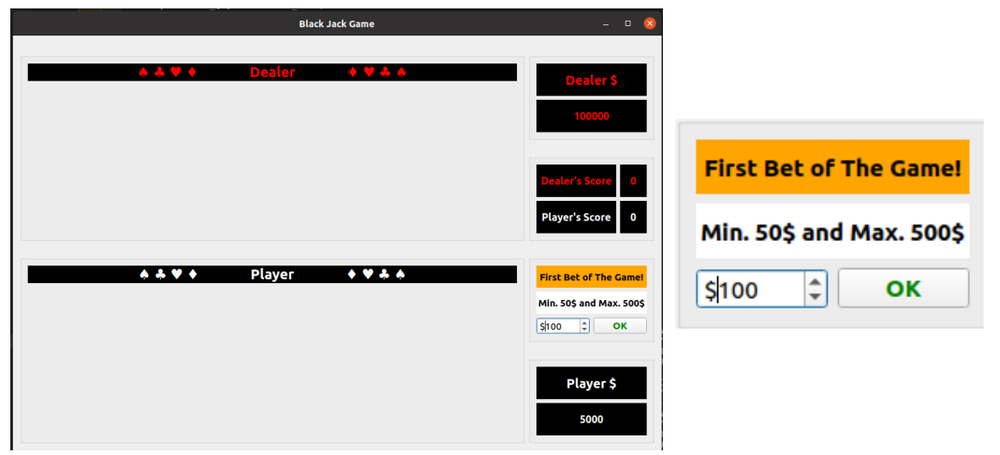
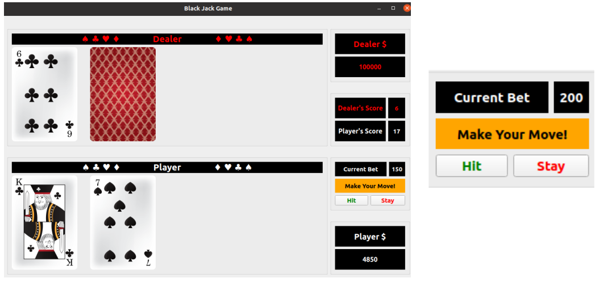
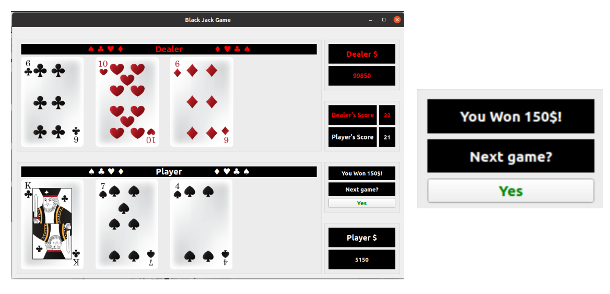
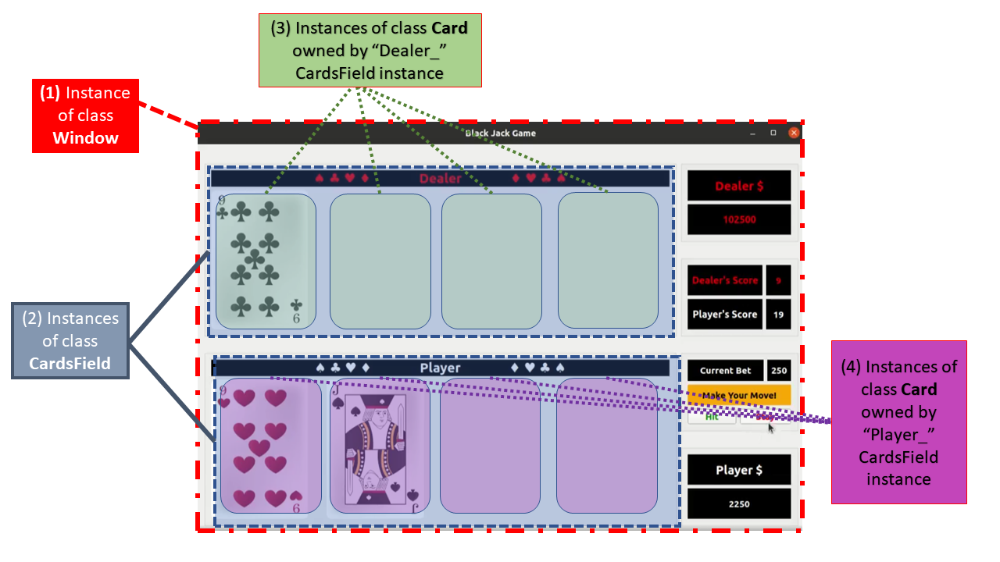

# 14_BlackJack
## What is it?
It is a GUI based card game called ***Black Jack*** developed using C++ and Qt5. 

## Linux OS : Installation Requirements
(1) <code>gcc 9.3.0</code> or above, if not already installed please follow the steps shown [here.](https://linuxize.com/post/how-to-install-gcc-on-ubuntu-20-04/) 
(2) <code>cmake 3.20.4</code> or above, if not already installed please follow the steps shown [here.](https://cgold.readthedocs.io/en/latest/first-step/installation.html) 
(3) <code>QMake 3.1</code> or above and <code>Qt 5.12.8</code> or above, if not already installed please follow the steps shown [here.](https://www.addictivetips.com/ubuntu-linux-tips/how-to-install-qt-5-on-ubuntu/) 
(4) please run the command <code>sudo apt install libqt5multimedia5</code> in terminal to install multimedia package from Qt, required to produce the sound effets.  

## How to play the game?
(1) If you don't know the rules of the game BlackJack please watch [this](https://www.youtube.com/watch?v=qd5oc9hLrXg) video. It is pretty short and simple! 
(2) Please keep all the files as it is in the repo. Once, cloned in your local computer, open the terminal and nevigate to the source directory <code>14_BlackJAck</code>, then run <code>qmake && make && ./14_BlackJack</code> in your terminal. 
(3) First step will bring the window on your screen shown as below. Now, you will decide the amount you want to bet against house. 

  

(4) Now, one by one, four card will appear on your window. It will now change prompt to button **Hit** and **Stay**. As a player, now you will have to make your move by pressing one of the two buttons and try to maintain score of 21 or less.  

  

(5) Once, you have pressed **Stay** button, dealer will reveal the closed card and game will go on. Once, upon the completion of game, you will get message of wether you lost or won and by how much amount.

  

(6) Now, press **Yes** button and you will be directed to new game where the game will start with No.(3) again!  
(7) In case when dealer or player get more than 21, or player have black Jack, the game will restart with No.(3) again. 

## Files structure and its content
Here is the list of different files and information on what they contain:
<ul>
<li> <code>GameGUI.h</code>, Header file contains declaration of the class <code>Window</code> with functions responsible to draw and load widgets in main game window. It also contains declaration of the functions for game logic (defined in <code>GameLogic.cpp</code>), animation and sound effects (defined in <code>Blink.cpp</code>). </li>
<li> <code>GameGUI.cpp</code>, file contains definitions of the class <code>Window</code> and functions responsible to draw and load widgets in window. </li>
<li> <code>GameLogic.cpp</code>, file contains definitions of functions responsible to run the logic of the game **Black Jack**. </li>
<li> <code>Blink.cpp</code>, file contains definitions of functions responsible for blinking and sound effects. </li>
<li> <code>CardsField.h</code> and <code>CardsField.cpp</code>, file contains declaration and definition of class <code>CardsField</code>. It holds maximum 4 cards for individual participant and total score of an instance during the game. It also includes the Deck being used to get random cards out of it. </li>
<li> <code>Cards.h</code> and <code>Cards.cpp</code>, file contains declaration and definition of class <code>Card</code>. It holds image and value of an individual Card instance, and functions to apply Fade-In Fade-Out animation effect. </li> </ul>  

## How many classes are there?
There are three different classes being used here. 
<ul>
<li> First, the class <code>Window</code> is derived from <code>QObject</code> class of Qt5. Window class houses the main window prompt which enables player to play the game. <em>(NO.1 in the image below)</em> </li>
<li> Second, <code>CardsField</code>, derived from <code>QGroupBox</code> class, is the class which holds four cards for each, player and dealer, and each will have its own instance of this class. It is drawn and added in the main window of the game where fade in and fade out of cards will appear while playing game. <em>(NO.2 in the image below)</em> </li>
<li> Third, <code>Card</code>, derived from <code>QLabel</code> class, is the class, whoes instance holds individual image of the card, its name and its value. It also includes method to animate Fade-In and Fade-Out effects. <em>(NO.3 and NO.4 in the image below)</em> </li> </ul>  

  

## Before we go look at the activity table, let's see the variable layout!

Here in the image, all the variables of <code>QGroupBox</code> and <code>QGridLayout</code> are placed in the GameGUI window. They hold relative values of class instance which may be refreshed as the game goes on. These are drawn and loaded with the constructor of <code>Window *window</code> object which owns the <code>QGridLayout *GameGrid_</code> variable, as soon as the game is started. If more clarification is required, please refer to the code snippet [here.](https://github.com/CPaladiya/14_BlackJack/blob/458e3597828f7f070d637ef643651e88f652a973/GameGUI.cpp#L77-L84)   This should provide basic idea on how and where these prompts are added. 

  

## Udacity requirement check list

