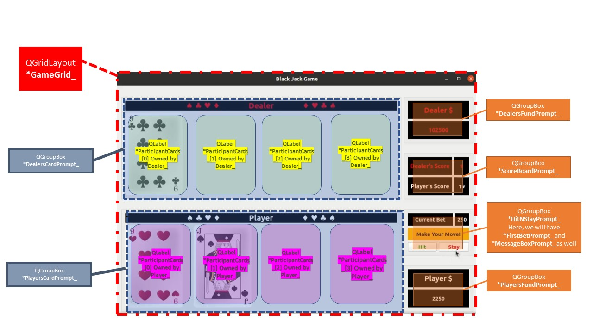

# 14_BlackJack
## What is it?
It is a GUI based card game called ***Black Jack*** developed using C++ and Qt5 

## Files and its content
Here is the list of different files and information on what they contain
<ul>
<li> <code>GameGUI.h</code>, Header file contains declaration of class <code>Window</code> with functions responsible to draw and load widgets in window. It also contains declaration of game logic, animation and sound effect functions. </li>
<li> <code>GameGUI.cpp</code>, file contains definitions of class <code>Window</code> and functions responsible to draw and load widgets in window. </li>
<li> <code>GameLogic.cpp</code>, file contains definitions of functions responsible to run the logic of the game. </li>
<li> <code>Blink.cpp</code>, file contains definitions of functions responsible for blinking and sound effect. </li>
<li> <code>CardsField.h</code> and <code>CardsField.h</code>, file contains declaration and definition of class <code>CardsField</code>. It holds cards for individual and total score of each participant. </li>
<li> <code>Cards.h</code> and <code>Cards.h</code>, file contains declaration and definition of class <code>Card</code>. It holds value of card, and animation for fade in and fade out of the card it self. </li>
<li> Second, <code>CardsField</code>, derived from <code>QGroupBox</code> class, is the class which holds four cards for player and dealer, each will have its own instance of this class. It is the place where fade in and fade out of cards will appear while playing game. </li>
<li> Third, <code>Card</code>, derived from <code>QLabel</code> class, is the class, whoes instance holds individual card and its value. It also includes method to Fade-In and Fade-Out cards. </li> </ul>  

## How is the code structured?
There are three different classes being used here. 
<ul>
<li> First, instance of a class <code>Window</code> derived from <code>QObject</code> class of Qt5 houses the main window prompt which enables player to play the game. </li>
<li> Second, <code>CardsField</code>, derived from <code>QGroupBox</code> class, is the class which holds four cards for player and dealer, each will have its own instance of this class. It is the place where fade in and fade out of cards will appear while playing game. </li>
<li> Third, <code>Card</code>, derived from <code>QLabel</code> class, is the class, whoes instance holds individual card and its value. It also includes method to Fade-In and Fade-Out cards. </li> </ul>  

 

## Before we go look at the activity table, let's see the variable layout!

Here in the image, all the variables of <code>QGroupBox</code> and <code>QGridLayout</code> are placed in the GameGUI window. They hold relative values of class instance which may be refreshed as the game goes on. These are drawn and loaded with the constructor of <code>Window *window</code> object , as soon as the game is started.  

